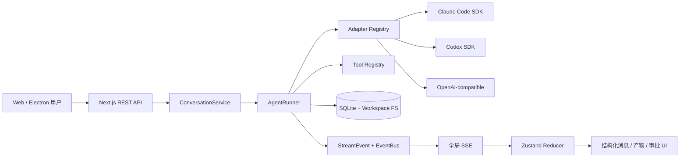
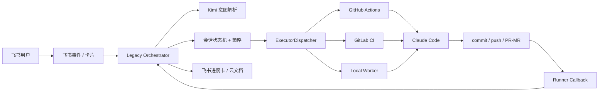
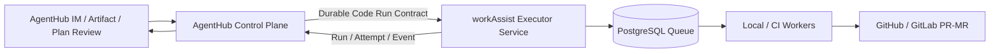

# AgentHub 与 workAssist 多维对比分析

> 分析日期：2026-08-26  
> AgentHub 快照：`main@a7ac2b6`  
> workAssist 对外稳定基线：`master@fb90c22`  
> workAssist 在研分支：`refactor/agent-platform@b8adb3e`  
> 结论依据：README / 设计文档 / 源码 / 测试结构 / Git 历史 / 本地只读验证。文档明确区分“已实现”“部分实现”“设计中”，不把路线图当作完成态。

## 1. 结论先行

两个项目都使用了 Agent、Orchestrator、Task 等概念，但它们解决的不是同一个问题：

- **AgentHub 是通用、local-first 的多 Agent 协作工作台**：重点是 IM 式交互、异构 Agent 适配、结构化消息、实时过程可视化、共享 workspace、产物预览和真正的多 Agent DAG 调度。
- **workAssist 是飞书驱动的代码自动化交付系统**：重点是从企业 IM 接收需求，经过澄清和审批，把任务交给 GitHub Actions、GitLab CI 或本机 Worker，再以分支、PR/MR 或飞书文档完成交付。

一句话概括：

> **AgentHub 更像 Agent 的“IDE + IM + 控制面”，workAssist 更像 Agent 化的“需求入口 + CI/Worker + 交付流水线”。**

最重要的判断如下：

1. **当前完成度、产品展示效果、真正的多 Agent 能力：AgentHub 明显领先。**
2. **企业工作流闭环、Git/PR 交付、分布式 Worker 可靠性设计：workAssist 更有业务针对性和后端系统深度。**
3. **workAssist 对外 `master` 目前本质仍是单 CodeAgent 自动化；多 Agent 平台只有 M1 骨架，DocAgent、多机器人 Channel 和并行编排尚未落地。**
4. **workAssist 在研分支的 Task/Run/Attempt、租约、心跳、fencing、幂等 PR 等设计很有面试价值，但当前合并提交包含大量未解决冲突，不能宣称为可运行完成态。**
5. **面试演示优先选 AgentHub；面试讲系统可靠性时重点讲 workAssist 的可靠 Worker 改造，但应先修复分支并补齐端到端证据。**

## 2. 分析范围与证据口径

### 2.1 仓库版本

| 项目 | 分支 / 提交 | 本文用途 |
|---|---|---|
| [bitdance-agenthub](https://github.com/lizyoko9/bitdance-agenthub) | [`a7ac2b6`](https://github.com/lizyoko9/bitdance-agenthub/tree/a7ac2b6a3cbcae59aad98e614bc8763a201e7b11) | 本地工作区与远程 `main` 一致，作为 AgentHub 实现依据 |
| [workAssist](https://github.com/YNAlone/workAssist) | [`fb90c22`](https://github.com/YNAlone/workAssist/tree/fb90c22906858a453a7b2c729c708ca4fa0f12ef) | GitHub 默认 `master`，作为对外稳定基线 |
| workAssist 在研架构 | [`b8adb3e`](https://github.com/YNAlone/workAssist/tree/b8adb3ecc4858102305cdb54d58544765f8817c8) | 本机 `refactor/agent-platform`，用于评价演进方向与当前风险 |

### 2.2 状态标记

- **已实现**：源码中存在完整调用链，接口可对应到具体执行路径。
- **部分实现**：有核心代码，但入口、下游、跨平台或可运行性仍不完整。
- **设计中**：只存在设计文档、stub 或未接通的抽象。
- **推断**：由代码结构得出的工程判断，文中会说明依据。

## 3. 产品定位与用户价值差异

| 维度 | AgentHub | workAssist |
|---|---|---|
| 核心用户 | 本机使用多个 Agent 的开发者、创作者 | 在飞书中发起研发任务的团队成员 |
| 首要问题 | 多 Agent 如何在一个可视化工作空间中协作 | 自然语言需求如何安全、异步地变成代码和 PR/MR |
| 主要入口 | Next.js Web / Electron 桌面端，移动伴随端 | 飞书机器人、卡片、HTTP API |
| 核心交互对象 | Conversation、Message、Artifact、Workspace、AgentRun | ConversationSession、Task；重构后为 Chat → Task → Run → Attempt |
| 交付物 | 对话结果、workspace 文件、网页/PPT/文档/图表等 Artifact、预览部署 | Git 分支、commit、PR/MR、本机 diff、飞书云文档 |
| 运行假设 | 本地单用户、单进程、SQLite | Orchestrator 与 CI/本机 Worker 可分布在不同机器 |
| 成功标准 | 协作过程可见、可控、可继续编辑 | 需求可追踪地进入代码交付闭环 |

因此，AgentHub 的竞争对象更接近 Claude Cowork、桌面 Agent 工作台、多 Agent Chat；workAssist 的竞争对象更接近“飞书 + Devin/Codex/Claude Code + CI/CD”的内部研发机器人。

## 4. 系统架构设计对比

### 4.1 AgentHub：分层、事件驱动的本地控制面



AgentHub 的核心不是某个模型，而是两套跨层契约：

- [`MessagePart`](../src/shared/types.ts)：文本、思考、工具调用、工具结果、附件、产物引用、部署状态分别建模，不靠 Markdown 正则解析。
- [`StreamEvent`](../src/shared/types.ts)：Adapter 输出、工具活动、审批、Artifact、调度、usage 都先统一成事件，再由 AgentRunner 持久化并通过 SSE 推给前端。

这种设计的价值是：Claude Code、Codex 和 OpenAI Chat Completions 的事件形态完全不同，但 L3 以上只认识 AgentHub 协议。新增模型平台时，主要成本集中在 Adapter 的事件翻译，而不是同时修改 UI、数据库和工具层。

AgentHub 的 Orchestrator 也没有另起一套服务。它仍通过同一个 [`AgentRunner`](../src/server/agent-runner.ts) 执行，只在 system prompt、工具和运行阶段上特殊化：

```text
PLAN → 编译/校验 Plan → 用户 Review Gate → DAG 分波并行
     → 子任务语义验收/命令验证 → 必要时 Replan → AGGREGATE
```

实际代码包含：

- 最多 4 个子 Agent 并发；
- 依赖闭包与缺失输入阻断；
- 同波次文件写冲突检测；
- `report_task_result` 语义完成门禁；
- `requiredCommands` 验证；
- 子任务最多 4 次续跑；
- 编排最多 4 轮重规划；
- 最终聚合阶段移除 `plan_tasks` / `ask_user`，避免重复规划。

这属于**已经落到代码里的多 Agent 调度系统**，不只是“同时调用两个模型”。

### 4.2 workAssist：企业 IM 驱动的异步交付流水线



workAssist 的稳定基线由两部分叠加：

1. `feishu_claude_automation`：真实业务主链路，负责飞书、多轮澄清、确认/审批、任务迭代、CI/Worker 调度和结果通知。
2. `agent_platform`：M1 平台骨架，引入 Job、PlatformTask、AgentRegistry、TaskBus、Executor 和 PostgreSQL。

它采用的是一种 **Strangler / 双轨重构** 思路：旧 `/ai-fix` 业务继续运行，新平台内核逐步包裹旧 CodeAgent 执行链路。这种迁移策略能降低一次性替换风险，但当前存在明显的双模型和双状态源复杂度。

最关键的事实是：稳定 `master` 中的 [`Planner`](https://github.com/YNAlone/workAssist/blob/fb90c22906858a453a7b2c729c708ca4fa0f12ef/src/agent_platform/planner.py) 每次只返回一个 PlatformTask；[`DocAgentExecutor`](https://github.com/YNAlone/workAssist/blob/fb90c22906858a453a7b2c729c708ca4fa0f12ef/src/agents/doc_agent.py) 明确是 M2 stub；多机器人 Feishu Channel 也是 M3 占位。因此它当前应描述为：

> **有多 Agent 平台抽象的单 CodeAgent 研发自动化系统，而不是已经完成的多 Agent 并行协作平台。**

### 4.3 架构风格总结

| 架构特征 | AgentHub | workAssist |
|---|---|---|
| 主架构 | 五层分层 + Adapter + 进程内事件驱动 | Channel / Platform Core / Executor + 异步回调 |
| 控制面 | 本地 AgentRunner | 云端/本地 Orchestrator |
| 执行面 | 同进程工具、SDK 子进程 | GitHub/GitLab Runner 或远程 Local Worker |
| 实时反馈 | token/part/tool 粒度 SSE | 阶段级飞书通知；重构分支增加结构化 Worker Event |
| 横向扩展 | 当前不适合，多数状态在内存且 SQLite 单机 | 方向上更适合；重构使用 PostgreSQL 队列与多 Worker claim |
| 失败恢复 | run 中止与可见错误较完整，进程重启恢复较弱 | `master` 较弱；可靠 Worker 分支设计更强 |

## 5. 具体实现方式对比

### 5.1 Agent 与模型接入

AgentHub 已实现四种 Adapter：

- Claude Code：`@anthropic-ai/claude-agent-sdk`，SDK session 续接、`canUseTool` 权限桥。
- Codex：`@openai/codex-sdk`，线程续接、隔离 `CODEX_HOME`、AgentHub MCP bridge。
- Custom：OpenAI Chat Completions 兼容协议，自行实现最多 8 轮的 tool loop，兼容 DeepSeek reasoning content。
- Mock：本地开发和 E2E。

workAssist 的模型角色更固定：

- Kimi API 用于飞书自然语言意图理解；
- Claude Code CLI / Action 负责代码分析和修改；
- Executor 只决定在 GitHub Actions、GitLab CI 还是 Local Worker 上运行。

换言之，AgentHub 抽象的是“**Agent 平台协议差异**”，workAssist 抽象的是“**执行位置和交付渠道差异**”。

### 5.2 编排粒度

| 能力 | AgentHub | workAssist |
|---|---|---|
| 计划生成 | LLM 调 `plan_tasks`，再编译、推断依赖、校验 DAG | 稳定版主要由 Kimi 把用户意图整理成单任务计划 |
| 人工确认 | Plan Review 支持批准、拒绝、自然语言修订 | 飞书卡片/文本确认，高风险任务审批 |
| 并行执行 | 按 DAG ready wave 并行，最多 4 个子 run | 稳定版无多 Agent 并行；多个独立任务可由不同 CI/Worker 执行 |
| 任务完成判定 | run 状态 + 结构化 task report + acceptance + 命令证据 | 主要依赖 callback status；可靠分支加入验证和阶段状态 |
| 失败处理 | 级联 skip、子任务续跑、最多 4 轮 replan | 稳定版失败回卡片；可靠分支加入 lease recovery / needs_attention |
| 最终汇总 | Orchestrator aggregate stage | 飞书任务卡/报告；多 Agent 汇总仍是设计目标 |

### 5.3 消息与事件模型

AgentHub 的强项是从数据库到 UI 使用同一套 discriminated union。工具调用不会被降级成一段日志，前端可独立渲染 bash、diff、artifact、deployment 和 dispatch plan。

workAssist 稳定版使用任务状态枚举和松散 callback JSON，适合“阶段型流水线”，但不适合 token 级交互。可靠分支的 `worker_events` 已增加 `(run_id, attempt_no, sequence)` 唯一约束，这是面向重放和去重的好设计，但它尚未形成类似 AgentHub 的端到端 UI 事件协议。

### 5.4 上下文与记忆

AgentHub 实现了：

- Custom Agent 的有界历史序列化；
- 群聊中“其他 Agent 发言”视角转换；
- pinned 消息长期注入；
- 手动 context compaction；
- Claude/Codex session/thread resume；
- 子 Agent 隔离 prompt，不重复注入完整群聊历史。

workAssist 稳定版把多轮澄清存为 `ConversationSession.messages`，目标是补全 repo、base branch、prompt，再触发任务；它不是面向通用聊天知识记忆。可靠分支开始持久化 Claude Session ID，用于 Worker 崩溃后的 `--resume`，这是执行恢复语义，不是完整对话记忆。

### 5.5 Workspace 与 Git 工作区

AgentHub 把 workspace 作为 Conversation 的一等实体：

- Sandbox 模式：每个会话独立目录并限制 100 MB / 1000 文件；
- Local 模式：绑定真实项目目录；
- `fs_read` / `fs_write` / `bash` 强制路径包含检查；
- Review / Auto 写入模式；
- UI 内文件浏览、编辑、diff 和静态预览。

workAssist 把 Git 分支/worktree 作为业务 Task 的工作现场：

- 稳定版 Local Worker 直接在配置的共享仓库执行 `checkout -B`；
- 可靠分支改为 `<worktree-root>/<repo>/<task_id>` 持久 worktree；
- 一个飞书群对应长期 Task，同一 Task 复用固定分支和 worktree；
- commit、push、PR/MR 由 Worker 控制器负责，不由模型直接决定。

这两种设计分别服务于“交互式本地工作”和“可恢复的异步交付”。workAssist 的持久 worktree 模型更适合长任务和跨进程恢复；AgentHub 的 Conversation Workspace 更适合即时协作和人工编辑。

### 5.6 持久化与一致性

AgentHub 使用 SQLite + Drizzle，核心 9 张表把 Agent、Conversation、Message、Artifact、Workspace、Attachment、AgentRun、ContextSummary、AppSettings 分离。优点是本地部署简单、实体边界清楚；限制是：

- EventBus、active run、待审批 Promise 和 SDK session 映射大多在内存；
- 进程重启时无法像 durable workflow 一样恢复正在执行的 run；
- `part.delta` 每次都更新 SQLite message JSON，长输出和多并发时可能产生写放大。

workAssist `master` 同时存在：

- legacy JSON task/session/worker queue；
- 新平台 PostgreSQL jobs/tasks/audit/user_oauth。

这能兼容旧链路，但“谁是真相源”不够统一。可靠分支的目标更清晰：PostgreSQL 成为唯一生产状态源，JSON 只做迁移输入，并加入：

- `(tenant_key, chat_id)` 唯一 Task；
- event/message inbox 去重；
- command → Run 幂等；
- 一个 Run 一个 worker job；
- `SELECT ... FOR UPDATE SKIP LOCKED` 并发 claim；
- attempt + lease token + 过期时间的 fencing；
- ordered worker event；
- commit/push/PR 分阶段幂等。

这一部分是 workAssist 最有后端含金量的设计。

### 5.7 安全模型

AgentHub 假设 LLM 输出不可信，安全控制更靠近工具执行边界：

- zod 校验 API body 和工具参数；
- workspace path containment；
- Win/POSIX 双平台命令黑名单；
- 依赖安装、Git 丢弃、递归删除等命令需人工批准；
- Claude SDK 的 Read/Write/Edit/Bash 经过 permission bridge；
- 生成网页使用 sandboxed iframe；
- 所有 LLM 调用支持 AbortSignal。

它仍是“本地单用户软沙箱”，不是强 OS 隔离：正则黑名单不是容器/虚拟机；部分 SDK 自带写盘路径绕过 AgentHub 配额；API key 以明文形式存在本地 SQLite。

workAssist 的业务安全边界包括：

- 仓库和请求者白名单；
- 受保护分支不能作为工作分支；
- 风险关键词触发审批；
- 默认创建 PR/MR，不自动合并；
- Worker API 使用 Bearer token；
- 飞书事件校验 verification token。

但稳定 `master` 仍有几项必须整改的风险：

1. Local Worker 调 Claude 时使用 `--dangerously-skip-permissions` 且允许 Bash。
2. `/callbacks/runner`、`/v1/jobs`、`/v1/tasks/callback` 没有统一签名或服务鉴权；当 Orchestrator 暴露公网时不够稳妥。
3. API payload 主要靠字典取值和手工判断，没有系统化 schema 校验。
4. `policy.example.json` 带有环境相关的内部地址和个人绝对路径，不利于公开仓库的配置卫生与可移植性。

可靠 Worker 分支已移除危险权限参数并加强副作用控制，这是正确方向，但当前分支首先需要恢复可运行性。

## 6. 功能矩阵

| 功能 | AgentHub | workAssist `master` | workAssist 在研方向 |
|---|---|---|---|
| 自建 IM 界面 | 已实现 | 无，依赖飞书 | Web IM 只有设计文档 |
| 飞书集成 | 无 | 已实现事件、卡片、通知、云文档 | 增加长连接、多机器人 |
| 多会话 / 群聊 / @Agent | 已实现 | 飞书会话入口；应用内无消息 UI | 多机器人群协作设计中 |
| 真正多 Agent DAG | 已实现 | 未实现 | 仍未在当前 Planner 落地 |
| Plan 人工审阅和修订 | 已实现 | 单任务确认/审批已实现 | 可继续演进 |
| Claude Code | SDK Adapter | CLI / GitHub Action | CLI session resume |
| Codex | 已实现 SDK Adapter | 无 | 无明确实现 |
| 自定义模型 Provider | OpenAI/DeepSeek/Ark/兼容端点 | Kimi/Anthropic 兼容配置为主 | 可扩展，但未形成 Adapter 生态 |
| 工具系统 | 中央 registry + MCP bridge | Claude 内置工具 + Executor | Agent 工具白名单设计中 |
| 本地文件编辑 | 已实现，带 UI diff/审批 | Local Worker 可修改仓库 | 持久 worktree + 验证修复 |
| GitHub/GitLab PR/MR | 无原生结构化交付工具 | 已实现 | 加强幂等和恢复 |
| Artifact 模型 | Web、文档、图、PPT、代码、diff、部署 | PR/MR、报告文档、diff stat | DocAgent 计划接飞书 MCP |
| 运行过程实时可视化 | token/part/tool/dispatch 级 | 阶段级飞书消息 | 结构化 worker event 已有代码 |
| 写入/命令审批 | 已实现 | 风险级任务审批 | 更细粒度控制仍需完善 |
| 可靠异步队列 | 无 durable queue | JSON queue + flock | PostgreSQL lease/fencing 已写但分支不可运行 |
| 桌面端 | Electron 已实现 | 无 | 无 |
| 移动端 | Capacitor 伴随端部分实现 | 飞书天然可在手机使用 | Web IM 尚未落地 |
| 搜索、书签、Pin、上下文压缩 | 已实现 | 无同类应用 UI | 无 |
| PPT / Web 预览和导出 | 已实现 | 无 | 无 |

## 7. 工程成熟度与当前代码健康度

### 7.1 规模快照

以下数字是本次快照的近似静态统计，只用于观察工程形态，不等同于质量评分。

| 指标 | AgentHub | workAssist `master` | workAssist `refactor` |
|---|---:|---:|---:|
| 主源码文件 | 约 233 个 TS/TSX | 38 个 Python | 42 个 Python |
| 主源码行数 | 约 38.8k | 约 4.6k | 约 8.3k |
| 测试文件 | 29 | 7 | 12 |
| 静态识别测试用例 | 约 188 | 约 50 | 约 81 |

AgentHub 的代码量体现了产品面和 UI 面较完整，也暴露出两个过大的核心模块：`agent-runner.ts` 约 2600 行，`app-store.ts` 约 1270 行。架构原则清楚，但核心复杂度正在向少数“上帝模块”集中。

workAssist 代码量更小，业务链路集中，适合快速交付；但 legacy Orchestrator、server、LLM、Local Worker 都较重，加上新旧双轨后，模块边界开始混杂。

### 7.2 本次验证结果

| 项目/分支 | 验证 | 结果 |
|---|---|---|
| AgentHub `main` | 冲突标记扫描 | 未发现冲突标记 |
| AgentHub `main` | typecheck / lint / test | 本地未安装 `node_modules`，未下载依赖，因此本次未执行；仓库包含 lockfile、29 个测试文件和 Playwright 基建 |
| workAssist `master` | Python AST 解析 | 45 个源码/测试文件，0 个语法错误 |
| workAssist `master` | Windows pytest 收集 | 3 个测试模块因 `local_worker_queue.py` 直接依赖 POSIX `fcntl` 而收集失败 |
| workAssist `refactor` | Python AST 解析 | 54 个文件中 10 个语法错误 |
| workAssist `refactor` | 合并标记扫描 | 10 个文件、102 行 `<<<<<<< / ======= / >>>>>>>` 标记 |

workAssist 当前 `b8adb3e` 是一个 merge commit，把“可靠 Worker”和“长连接/只读分析”两条支线合在一起，但没有正确解决冲突。受影响文件包括 CodeAgent、cards、config、LLM、Local Worker、models、Orchestrator、policy、server 和测试。这是当前最高优先级问题，也说明分支保护和 CI merge gate 尚未发挥作用。

### 7.3 主要技术债

#### AgentHub

- AgentRunner 和前端 Store 过大，功能继续增长会降低可测试性。
- run、审批 resolver、EventBus、SDK session 主要在内存，进程级故障恢复弱。
- 每个流式 delta 写 SQLite，需评估节流、批量刷盘或 append log。
- 单全局 SSE 没有 event id / replay；更适合本地单实例，不适合水平扩展。
- 功能面很宽，移动端、SDK 沙箱盲区、E2E 覆盖仍有未完成项。

#### workAssist

- 多 Agent 宣称领先于实际实现，稳定版只有单任务路由和 DocAgent stub。
- legacy JSON 与新 PostgreSQL 双状态模型并存，领域词汇还存在 `Job`/`Task`/`Run` 反转：`jobs.id` 又被称为 `task_id`，`tasks.id` 又被称为 `run_id`。
- stdlib `http.server` 路由、业务组装、鉴权、callback 混在一个 Handler 中。
- 稳定版 Local Worker 的共享 checkout、JSON queue、`fcntl` 和危险权限不适合可靠生产执行。
- 在研 merge commit 当前不可导入，任何功能演示和测试结论都应以修复后的新提交为准。
- 仓库根目录未见明确 LICENSE，若准备开源传播或面试公开展示，建议补齐许可证和贡献边界。

## 8. 各自最值得讲的面试亮点

### 8.1 AgentHub：适合全栈、前端架构、Agent 平台岗位

#### 亮点 A：统一异构 Agent 的事件协议

推荐表达：

> 我没有让前端分别理解 Claude、Codex 和 OpenAI 的流式格式，而是在 Adapter 层把它们统一翻译为 StreamEvent。AgentRunner 负责同一份事件的持久化与广播，前端 Zustand reducer 只消费领域事件。这样新增 Adapter 时，不需要重写消息 UI、工具 UI 和数据库逻辑。

面试追问可展开：

- 为什么是 discriminated union，而不是通用 JSON event？—— 类型穷尽检查、事件契约可演进、前后端一致。
- 为什么 SSE 而不是 WebSocket？—— 当前主要是服务端向浏览器推流，操作仍走 REST；本地单用户下 SSE 更简单，EventSource 自带重连。代价是双向协议和水平扩展能力弱。
- 如何防止 UI 和 DB 状态不一致？—— AgentRunner 先持久化再 publish，前端 reducer 按 id 应用；HTTP 首屏和 SSE 增量分工。

#### 亮点 B：不是“并发调用”，而是有完成门禁的 DAG 编排

推荐表达：

> Orchestrator 先通过工具输出结构化计划，系统再编译和校验依赖，经过用户审阅后按 DAG 分波执行。子 Agent 不能仅靠自然语言说“完成了”，必须提交结构化 task report，并满足 acceptance criteria 和 required commands；失败会阻断下游或触发有限重规划。

这个亮点能覆盖 DAG、并发控制、human-in-the-loop、契约校验、失败传播、重试边界和 LLM 不可信输出治理。

#### 亮点 C：本地 Agent 的安全边界

可讲 workspace containment、Review/Auto、Bash 黑名单 + 高风险审批、SDK permission bridge、AbortSignal 和跨平台子进程清理。需要主动说明它是本地软沙箱，不夸大成容器级隔离。

#### 亮点 D：Artifact 是独立领域对象

产物不塞进 Message Markdown，而是单独版本化、预览、编辑、导出和部署。PPT 的语义 block、预览与 `.pptx` 导出共享 theme token，是很适合前端/全栈岗位的完整功能故事。

### 8.2 workAssist：适合后端、平台工程、DevOps、企业集成岗位

#### 亮点 A：从企业 IM 到 PR/MR 的完整业务闭环

推荐表达：

> 用户在飞书发自然语言需求，Orchestrator 用 Kimi 做意图解析和多轮澄清，经过策略与人工确认后，把执行派到 GitHub Actions、GitLab CI 或本机 Worker。执行器负责分支、提交、PR/MR，结果再通过 callback 回到同一飞书会话，后续“再改一下”复用原工作分支继续迭代。

这是 workAssist 当前最真实、最容易证明业务价值的部分。它不是一个 Chat Demo，而是一条面向交付物的自动化链路。

#### 亮点 B：Task / Run / Attempt 与 lease fencing

这是 workAssist 在研架构最强的系统设计点：

- 飞书群是稳定业务入口；
- Task 是长期目标和固定分支/worktree；
- Run 是一次新需求或重试；
- Attempt 是 Worker 对同一 Run 的一次领取；
- lease token 防止旧 Worker 的迟到回调覆盖新 Attempt；
- 心跳连续失败后停止 Claude 和后续 Git 副作用；
- `SKIP LOCKED` 支持多个 Worker 并发 claim。

面试时可以用“Worker 在 push 后、回写数据库前崩溃怎么办”作为主线，继续讲：

- commit message 带 run id；
- push 前后比较远端 SHA；
- 创建 PR/MR 前按 source/target/opened 查询；
- 重放时只补缺失阶段，不产生第二个 PR。

这比泛泛讲“做了重试”有含金量得多。

#### 亮点 C：渐进式重构而非推倒重来

旧 `/ai-fix` 保留为兼容 Channel，新 `agent_platform` 逐步引入 registry、bus、executor 和 PostgreSQL。这是合理的迁移策略。面试时也应诚实讲双轨带来的双状态源、命名和回归成本，以及最终如何收敛。

#### 亮点 D：企业权限与人机协作

飞书身份、repo allowlist、受保护分支、风险审批、PR 不自动合并、DocAgent UAT/OAuth 设计，都体现了“模型输出不能直接成为生产副作用”的意识。

## 9. 面试中如何选择和组合两个项目

### 9.1 岗位匹配

| 岗位方向 | 主讲项目 | 原因 |
|---|---|---|
| 前端 / 全栈 | AgentHub | UI、实时状态、结构化渲染、Electron、Artifact、复杂交互更完整 |
| Agent 平台 / LLM 应用 | AgentHub 为主，workAssist 为辅 | Adapter/Event Contract 和 DAG 编排可讲平台抽象，workAssist补真实交付 |
| 后端 / 分布式系统 | 修复后的 workAssist 可靠 Worker | lease、heartbeat、fencing、幂等、副作用恢复更有深度 |
| DevOps / 研发效能 | workAssist | GitHub/GitLab、CI、分支、PR/MR 和企业 IM 闭环直接相关 |
| 桌面应用 | AgentHub | Next standalone + Electron + native SQLite ABI 是完整工程问题 |

### 9.2 推荐的双项目叙事

不要把它们讲成两个重复的“多 Agent 平台”。更好的叙事是：

> 我先在 workAssist 中解决真实团队如何从飞书安全地把需求交给代码 Agent，并可靠产出 PR；随后在 AgentHub 中进一步抽象异构 Agent、结构化事件、共享 workspace 和多 Agent DAG，解决协作过程本身的可视化与通用化。前者证明业务闭环，后者证明平台抽象和产品能力。

### 9.3 不能过度宣称的内容

- 不要说 workAssist 已完成多 Agent 并行编排；当前稳定版没有。
- 不要说 workAssist 可靠 Worker 已在当前 HEAD 全量通过；当前 refactor merge 无法解析。
- 不要说 AgentHub 是分布式、可水平扩展的 Agent 平台；它明确是本地单实例设计。
- 不要说 AgentHub 是强安全沙箱；它主要是路径约束、审批和命令规则。
- 不要说两个项目的移动端都完成；AgentHub 伴随端仍是部分完成，workAssist 主要依赖飞书移动端。

## 10. 哪个项目更强

如果以“今天拉下代码能否形成完整演示”和“实现与宣称是否一致”为标准：

> **AgentHub 当前更强，也更适合作为主项目。**

它已经把多 Adapter、结构化消息、真实 DAG、工具审批、Artifact、桌面端和测试骨架接成了一个整体。

如果以“解决企业研发交付问题”和“后端可靠性设计上限”为标准：

> **workAssist 的方向更垂直，可靠 Worker 改造完成后可能更能体现生产系统深度。**

但前提是先完成三件事：修复 merge、以 PostgreSQL 为唯一真相源、用真实端到端测试证明崩溃恢复和幂等副作用。

## 11. 优先改进建议

### 11.1 workAssist：P0

1. **修复 `b8adb3e` 的所有冲突并新增 CI merge gate**：至少执行 AST/compile、pytest、冲突标记扫描和 Alembic 校验；保护 `master` 与 `refactor`。
2. **给外部入口统一鉴权**：Runner callback 使用 HMAC、时间戳和重放窗口；平台 API 加 service token 或明确限制为内网。
3. **移除危险执行模式**：保持 refactor 分支移除 `--dangerously-skip-permissions` 的方向，把允许工具和 Git 副作用边界写成可测试策略。
4. **清理示例配置**：删除内部域名和个人绝对路径，用占位符；补 LICENSE。

### 11.2 workAssist：P1

1. 统一领域词汇，建议数据库/代码都使用 `task`、`run`、`attempt`，减少 `Job → task_id`、`Task → run_id` 的认知反转。
2. 明确 PostgreSQL 为唯一状态源，逐步只读 legacy JSON，最后删除双写。
3. 要么真正实现 DocAgent + 多任务 Planner + 汇总，要么把 README 定位收敛为 Code Automation，避免能力错位。
4. 增加 mock Feishu、mock CI、假 Worker 的端到端测试，覆盖重复消息、重复点击、过期 lease、push 后崩溃、PR 已存在。
5. 明确 Local Worker 支持平台；若支持 Windows，彻底替换 `fcntl` 路径并加入 Windows CI。

### 11.3 AgentHub：P1

1. 拆分 AgentRunner：RunLifecycle、PlanCoordinator、DagExecutor、StreamPersister、PromptBuilder 分模块。
2. 拆分前端 Store，把消息、调度、审批、Artifact、文件状态分 slice。
3. 持久化 pending approval 和 active run metadata；重启后至少能明确标记 interrupted，而不是静默丢失。
4. 对流式 delta 做节流/批量持久化，同时保持 SSE 实时推送。
5. 给 SSE 增加 event id / snapshot reconciliation，降低断线窗口内的状态丢失。

## 12. 两个项目可以如何合并优势

最自然的组合不是复制功能，而是形成控制面与执行面的边界：



建议的职责划分：

- AgentHub 保留 Conversation、MessagePart、StreamEvent、Artifact、Plan Review、DAG 和 UI。
- workAssist 提供 durable code execution API，负责 Task/Run/Attempt、worktree、验证、commit、push、PR/MR 和恢复。
- 两者通过明确的 CodeRun contract 连接，而不是共享数据库。
- workAssist 的 Worker Event 由一个 AgentHub Adapter 翻译为 StreamEvent。

这样既保留 AgentHub 的交互和平台抽象，也补上本地进程长任务缺少的 durable execution。

## 13. 最终评价

AgentHub 的优秀之处是**把多 Agent 协作做成了一个结构化产品**：统一事件、统一消息、统一工具和完整 UI。它的下一阶段不是继续堆功能，而是控制核心模块复杂度并补强运行持久性。

workAssist 的优秀之处是**把 Agent 接进了真实研发交付链路**：飞书、策略、CI、Worker、Git 和 PR/MR 都是真实边界。它的下一阶段不是继续扩大“多 Agent”叙事，而是先恢复分支健康、收敛状态模型、证明可靠 Worker 的运行证据，再实现 DocAgent 和多任务编排。

面试中的最佳定位是：

> **AgentHub 展示产品化与平台抽象，workAssist 展示业务闭环与可靠执行。两个项目互补，而不是谁替代谁。**

## 14. 关键源码索引

### AgentHub

- [项目协作与架构约定](../CLAUDE.md)
- [统一 MessagePart / StreamEvent](../src/shared/types.ts)
- [AgentRunner 与 Orchestrator DAG](../src/server/agent-runner.ts)
- [Adapter 接口](../src/server/adapters/types.ts)
- [Custom Agent tool loop](../src/server/adapters/custom-agent-adapter.ts)
- [Claude Code permission bridge](../src/server/adapters/claude-code-adapter.ts)
- [Codex SDK Adapter](../src/server/adapters/codex-adapter.ts)
- [SQLite / Drizzle schema](../src/db/schema.ts)
- [Workspace 路径边界](../src/server/workspace-utils.ts)
- [平台命令安全规则](../src/server/security.ts)

### workAssist

- [稳定版 Orchestrator](https://github.com/YNAlone/workAssist/blob/fb90c22906858a453a7b2c729c708ca4fa0f12ef/src/feishu_claude_automation/orchestrator.py)
- [稳定版 HTTP Server](https://github.com/YNAlone/workAssist/blob/fb90c22906858a453a7b2c729c708ca4fa0f12ef/src/feishu_claude_automation/server.py)
- [稳定版 Local Worker](https://github.com/YNAlone/workAssist/blob/fb90c22906858a453a7b2c729c708ca4fa0f12ef/src/feishu_claude_automation/local_worker.py)
- [GitHub Actions 交付流程](https://github.com/YNAlone/workAssist/blob/fb90c22906858a453a7b2c729c708ca4fa0f12ef/.github/workflows/feishu-claude.yml)
- [多 Agent 重构设计](https://github.com/YNAlone/workAssist/blob/b8adb3ecc4858102305cdb54d58544765f8817c8/docs/refactor-agent-platform.md)
- [可靠 Worker 实施说明](https://github.com/YNAlone/workAssist/blob/b8adb3ecc4858102305cdb54d58544765f8817c8/docs/executor-local-worker-reliability-implementation.md)
- [PostgreSQL Durable Worker Queue](https://github.com/YNAlone/workAssist/blob/b8adb3ecc4858102305cdb54d58544765f8817c8/src/agent_platform/worker_store.py)
- [当前冲突示例：CodeAgent](https://github.com/YNAlone/workAssist/blob/b8adb3ecc4858102305cdb54d58544765f8817c8/src/agents/code_agent.py)
